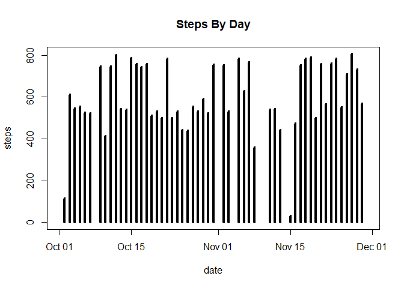
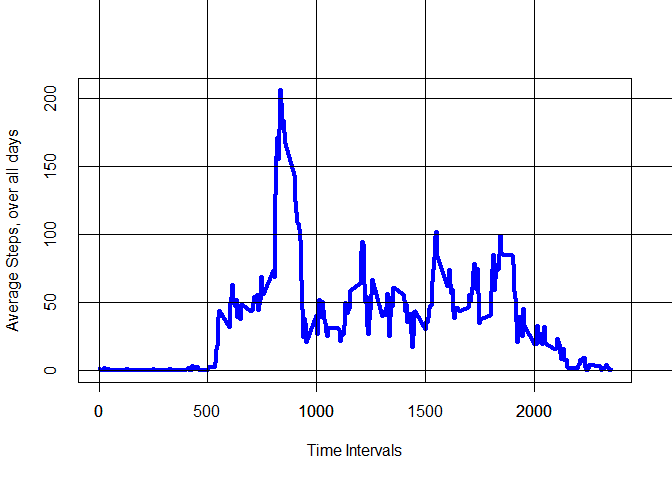
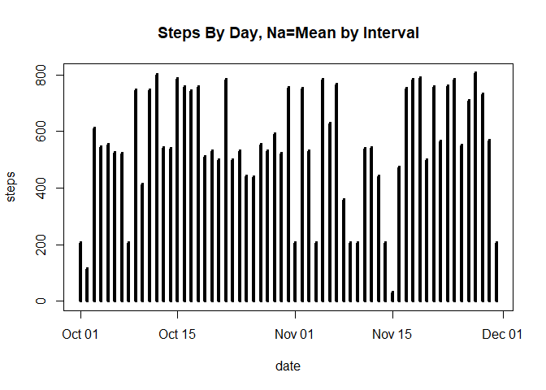
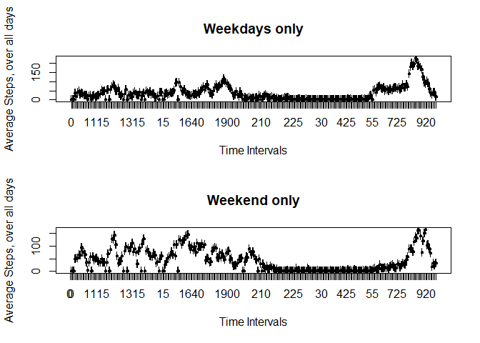

# Reproducible Research: Peer Assessment 1


## Loading and preprocessing the data

```r
library(ggplot2)
library(dplyr)
```

```
## 
## Attaching package: 'dplyr'
```

```
## The following objects are masked from 'package:stats':
## 
##     filter, lag
```

```
## The following objects are masked from 'package:base':
## 
##     intersect, setdiff, setequal, union
```

```r
library(data.table)
```

```
## 
## Attaching package: 'data.table'
```

```
## The following objects are masked from 'package:dplyr':
## 
##     between, first, last
```

```r
temp <- tempfile()
download.file("https://d396qusza40orc.cloudfront.net/repdata%2Fdata%2Factivity.zip", temp)
data <- read.csv(unz(temp, "activity.csv"), stringsAsFactors = FALSE)
unlink(temp)

data$date <- as.Date(data$date, format="%Y-%m-%d")
```
## What is mean total number of steps taken per day?

###First plot the steps per day by date


```r
with(data, 
     plot(date, steps, 
          xlab="date",
          ylab="steps",
          main = "Steps By Day",
          type="h", lwd=4))
```

<!-- -->

### Calculate the mean of steps, by date


```r
cdata <- na.omit(data)  #remove NAs
origMean <- as.data.frame(tapply(cdata$steps, cdata$date, mean)) #calculate mean, by date
setDT(origMean, keep.rownames = TRUE)[]
```

```
##             rn tapply(cdata$steps, cdata$date, mean)
##  1: 2012-10-02                             0.4375000
##  2: 2012-10-03                            39.4166667
##  3: 2012-10-04                            42.0694444
##  4: 2012-10-05                            46.1597222
##  5: 2012-10-06                            53.5416667
##  6: 2012-10-07                            38.2465278
##  7: 2012-10-09                            44.4826389
##  8: 2012-10-10                            34.3750000
##  9: 2012-10-11                            35.7777778
## 10: 2012-10-12                            60.3541667
## 11: 2012-10-13                            43.1458333
## 12: 2012-10-14                            52.4236111
## 13: 2012-10-15                            35.2048611
## 14: 2012-10-16                            52.3750000
## 15: 2012-10-17                            46.7083333
## 16: 2012-10-18                            34.9166667
## 17: 2012-10-19                            41.0729167
## 18: 2012-10-20                            36.0937500
## 19: 2012-10-21                            30.6284722
## 20: 2012-10-22                            46.7361111
## 21: 2012-10-23                            30.9652778
## 22: 2012-10-24                            29.0104167
## 23: 2012-10-25                             8.6527778
## 24: 2012-10-26                            23.5347222
## 25: 2012-10-27                            35.1354167
## 26: 2012-10-28                            39.7847222
## 27: 2012-10-29                            17.4236111
## 28: 2012-10-30                            34.0937500
## 29: 2012-10-31                            53.5208333
## 30: 2012-11-02                            36.8055556
## 31: 2012-11-03                            36.7048611
## 32: 2012-11-05                            36.2465278
## 33: 2012-11-06                            28.9375000
## 34: 2012-11-07                            44.7326389
## 35: 2012-11-08                            11.1770833
## 36: 2012-11-11                            43.7777778
## 37: 2012-11-12                            37.3784722
## 38: 2012-11-13                            25.4722222
## 39: 2012-11-15                             0.1423611
## 40: 2012-11-16                            18.8923611
## 41: 2012-11-17                            49.7881944
## 42: 2012-11-18                            52.4652778
## 43: 2012-11-19                            30.6979167
## 44: 2012-11-20                            15.5277778
## 45: 2012-11-21                            44.3993056
## 46: 2012-11-22                            70.9270833
## 47: 2012-11-23                            73.5902778
## 48: 2012-11-24                            50.2708333
## 49: 2012-11-25                            41.0902778
## 50: 2012-11-26                            38.7569444
## 51: 2012-11-27                            47.3819444
## 52: 2012-11-28                            35.3576389
## 53: 2012-11-29                            24.4687500
##             rn tapply(cdata$steps, cdata$date, mean)
```

```r
colnames(origMean) <- c("date", "mean_of_steps_byDate")
print(origMean)
```

```
##           date mean_of_steps_byDate
##  1: 2012-10-02            0.4375000
##  2: 2012-10-03           39.4166667
##  3: 2012-10-04           42.0694444
##  4: 2012-10-05           46.1597222
##  5: 2012-10-06           53.5416667
##  6: 2012-10-07           38.2465278
##  7: 2012-10-09           44.4826389
##  8: 2012-10-10           34.3750000
##  9: 2012-10-11           35.7777778
## 10: 2012-10-12           60.3541667
## 11: 2012-10-13           43.1458333
## 12: 2012-10-14           52.4236111
## 13: 2012-10-15           35.2048611
## 14: 2012-10-16           52.3750000
## 15: 2012-10-17           46.7083333
## 16: 2012-10-18           34.9166667
## 17: 2012-10-19           41.0729167
## 18: 2012-10-20           36.0937500
## 19: 2012-10-21           30.6284722
## 20: 2012-10-22           46.7361111
## 21: 2012-10-23           30.9652778
## 22: 2012-10-24           29.0104167
## 23: 2012-10-25            8.6527778
## 24: 2012-10-26           23.5347222
## 25: 2012-10-27           35.1354167
## 26: 2012-10-28           39.7847222
## 27: 2012-10-29           17.4236111
## 28: 2012-10-30           34.0937500
## 29: 2012-10-31           53.5208333
## 30: 2012-11-02           36.8055556
## 31: 2012-11-03           36.7048611
## 32: 2012-11-05           36.2465278
## 33: 2012-11-06           28.9375000
## 34: 2012-11-07           44.7326389
## 35: 2012-11-08           11.1770833
## 36: 2012-11-11           43.7777778
## 37: 2012-11-12           37.3784722
## 38: 2012-11-13           25.4722222
## 39: 2012-11-15            0.1423611
## 40: 2012-11-16           18.8923611
## 41: 2012-11-17           49.7881944
## 42: 2012-11-18           52.4652778
## 43: 2012-11-19           30.6979167
## 44: 2012-11-20           15.5277778
## 45: 2012-11-21           44.3993056
## 46: 2012-11-22           70.9270833
## 47: 2012-11-23           73.5902778
## 48: 2012-11-24           50.2708333
## 49: 2012-11-25           41.0902778
## 50: 2012-11-26           38.7569444
## 51: 2012-11-27           47.3819444
## 52: 2012-11-28           35.3576389
## 53: 2012-11-29           24.4687500
##           date mean_of_steps_byDate
```

### Calculate the median of steps, by date


```r
origMedian <- as.data.frame(tapply(cdata$steps, cdata$date, median))
setDT(origMedian, keep.rownames = TRUE)[]
```

```
##             rn tapply(cdata$steps, cdata$date, median)
##  1: 2012-10-02                                       0
##  2: 2012-10-03                                       0
##  3: 2012-10-04                                       0
##  4: 2012-10-05                                       0
##  5: 2012-10-06                                       0
##  6: 2012-10-07                                       0
##  7: 2012-10-09                                       0
##  8: 2012-10-10                                       0
##  9: 2012-10-11                                       0
## 10: 2012-10-12                                       0
## 11: 2012-10-13                                       0
## 12: 2012-10-14                                       0
## 13: 2012-10-15                                       0
## 14: 2012-10-16                                       0
## 15: 2012-10-17                                       0
## 16: 2012-10-18                                       0
## 17: 2012-10-19                                       0
## 18: 2012-10-20                                       0
## 19: 2012-10-21                                       0
## 20: 2012-10-22                                       0
## 21: 2012-10-23                                       0
## 22: 2012-10-24                                       0
## 23: 2012-10-25                                       0
## 24: 2012-10-26                                       0
## 25: 2012-10-27                                       0
## 26: 2012-10-28                                       0
## 27: 2012-10-29                                       0
## 28: 2012-10-30                                       0
## 29: 2012-10-31                                       0
## 30: 2012-11-02                                       0
## 31: 2012-11-03                                       0
## 32: 2012-11-05                                       0
## 33: 2012-11-06                                       0
## 34: 2012-11-07                                       0
## 35: 2012-11-08                                       0
## 36: 2012-11-11                                       0
## 37: 2012-11-12                                       0
## 38: 2012-11-13                                       0
## 39: 2012-11-15                                       0
## 40: 2012-11-16                                       0
## 41: 2012-11-17                                       0
## 42: 2012-11-18                                       0
## 43: 2012-11-19                                       0
## 44: 2012-11-20                                       0
## 45: 2012-11-21                                       0
## 46: 2012-11-22                                       0
## 47: 2012-11-23                                       0
## 48: 2012-11-24                                       0
## 49: 2012-11-25                                       0
## 50: 2012-11-26                                       0
## 51: 2012-11-27                                       0
## 52: 2012-11-28                                       0
## 53: 2012-11-29                                       0
##             rn tapply(cdata$steps, cdata$date, median)
```

```r
colnames(origMedian) <- c("date", "median_of_steps_byDate")
print(origMedian)
```

```
##           date median_of_steps_byDate
##  1: 2012-10-02                      0
##  2: 2012-10-03                      0
##  3: 2012-10-04                      0
##  4: 2012-10-05                      0
##  5: 2012-10-06                      0
##  6: 2012-10-07                      0
##  7: 2012-10-09                      0
##  8: 2012-10-10                      0
##  9: 2012-10-11                      0
## 10: 2012-10-12                      0
## 11: 2012-10-13                      0
## 12: 2012-10-14                      0
## 13: 2012-10-15                      0
## 14: 2012-10-16                      0
## 15: 2012-10-17                      0
## 16: 2012-10-18                      0
## 17: 2012-10-19                      0
## 18: 2012-10-20                      0
## 19: 2012-10-21                      0
## 20: 2012-10-22                      0
## 21: 2012-10-23                      0
## 22: 2012-10-24                      0
## 23: 2012-10-25                      0
## 24: 2012-10-26                      0
## 25: 2012-10-27                      0
## 26: 2012-10-28                      0
## 27: 2012-10-29                      0
## 28: 2012-10-30                      0
## 29: 2012-10-31                      0
## 30: 2012-11-02                      0
## 31: 2012-11-03                      0
## 32: 2012-11-05                      0
## 33: 2012-11-06                      0
## 34: 2012-11-07                      0
## 35: 2012-11-08                      0
## 36: 2012-11-11                      0
## 37: 2012-11-12                      0
## 38: 2012-11-13                      0
## 39: 2012-11-15                      0
## 40: 2012-11-16                      0
## 41: 2012-11-17                      0
## 42: 2012-11-18                      0
## 43: 2012-11-19                      0
## 44: 2012-11-20                      0
## 45: 2012-11-21                      0
## 46: 2012-11-22                      0
## 47: 2012-11-23                      0
## 48: 2012-11-24                      0
## 49: 2012-11-25                      0
## 50: 2012-11-26                      0
## 51: 2012-11-27                      0
## 52: 2012-11-28                      0
## 53: 2012-11-29                      0
##           date median_of_steps_byDate
```


## What is the average daily activity pattern?

```r
### Calculate Average Steps over Each Time Interval
intervalData <- tapply(cdata$steps, cdata$interval, mean) #creates array of intervals and their means
intDat <- as.data.frame(intervalData)
namesDat <- names(intervalData) #takes names of array, sets to variable #must be a faster way to do this
intervalCom <- cbind(namesDat, intDat)
colnames(intervalCom) <- c("Time_Interval", "Avg_Steps_alldays")
with(intervalCom, plot(namesDat, intervalData, 
                       xlab="Time Intervals", 
                       ylab="Average Steps, over all days", 
                       type="l", 
                       tck=1000,
                       lwd=4, 
                       col="blue"))
axis(1, at = seq(0, 2400, by = 1000))
```

<!-- -->

There seems to be a spike in steps in the same time interval

### Which time interval gives the max amount of steps?

```r
maxsteps <- max(intervalCom$Avg_Steps_alldays)
intervalCom[intervalCom$Avg_Steps_alldays == maxsteps, ]
```

```
##     Time_Interval Avg_Steps_alldays
## 835           835          206.1698
```

## Imputing missing values
### The number of missing values in the data is below

```r
sum(is.na(data))
```

```
## [1] 2304
```
### Remove NA values and replace with the mean of steps by interval

```r
data2 <- data %>% group_by(interval) %>% mutate( steps= ifelse(is.na(steps), mean(steps, na.rm=TRUE), steps))
```

### Recalcuate #Steps per day & plot

```r
with(data2, 
     plot(date, steps, 
          xlab="date",
          ylab="steps",
          main = "Steps By Day, Na=Mean by Interval",
          type="h", lwd=4))
```

<!-- -->

### Recalculate Mean and Median


```r
newMean <- as.data.frame(tapply(data2$steps, data2$date, mean))
print(newMean)
```

```
##            tapply(data2$steps, data2$date, mean)
## 2012-10-01                            37.3825996
## 2012-10-02                             0.4375000
## 2012-10-03                            39.4166667
## 2012-10-04                            42.0694444
## 2012-10-05                            46.1597222
## 2012-10-06                            53.5416667
## 2012-10-07                            38.2465278
## 2012-10-08                            37.3825996
## 2012-10-09                            44.4826389
## 2012-10-10                            34.3750000
## 2012-10-11                            35.7777778
## 2012-10-12                            60.3541667
## 2012-10-13                            43.1458333
## 2012-10-14                            52.4236111
## 2012-10-15                            35.2048611
## 2012-10-16                            52.3750000
## 2012-10-17                            46.7083333
## 2012-10-18                            34.9166667
## 2012-10-19                            41.0729167
## 2012-10-20                            36.0937500
## 2012-10-21                            30.6284722
## 2012-10-22                            46.7361111
## 2012-10-23                            30.9652778
## 2012-10-24                            29.0104167
## 2012-10-25                             8.6527778
## 2012-10-26                            23.5347222
## 2012-10-27                            35.1354167
## 2012-10-28                            39.7847222
## 2012-10-29                            17.4236111
## 2012-10-30                            34.0937500
## 2012-10-31                            53.5208333
## 2012-11-01                            37.3825996
## 2012-11-02                            36.8055556
## 2012-11-03                            36.7048611
## 2012-11-04                            37.3825996
## 2012-11-05                            36.2465278
## 2012-11-06                            28.9375000
## 2012-11-07                            44.7326389
## 2012-11-08                            11.1770833
## 2012-11-09                            37.3825996
## 2012-11-10                            37.3825996
## 2012-11-11                            43.7777778
## 2012-11-12                            37.3784722
## 2012-11-13                            25.4722222
## 2012-11-14                            37.3825996
## 2012-11-15                             0.1423611
## 2012-11-16                            18.8923611
## 2012-11-17                            49.7881944
## 2012-11-18                            52.4652778
## 2012-11-19                            30.6979167
## 2012-11-20                            15.5277778
## 2012-11-21                            44.3993056
## 2012-11-22                            70.9270833
## 2012-11-23                            73.5902778
## 2012-11-24                            50.2708333
## 2012-11-25                            41.0902778
## 2012-11-26                            38.7569444
## 2012-11-27                            47.3819444
## 2012-11-28                            35.3576389
## 2012-11-29                            24.4687500
## 2012-11-30                            37.3825996
```

```r
newMedian <- as.data.frame(tapply(data2$steps, data2$date, median))
print(newMedian)
```

```
##            tapply(data2$steps, data2$date, median)
## 2012-10-01                                34.11321
## 2012-10-02                                 0.00000
## 2012-10-03                                 0.00000
## 2012-10-04                                 0.00000
## 2012-10-05                                 0.00000
## 2012-10-06                                 0.00000
## 2012-10-07                                 0.00000
## 2012-10-08                                34.11321
## 2012-10-09                                 0.00000
## 2012-10-10                                 0.00000
## 2012-10-11                                 0.00000
## 2012-10-12                                 0.00000
## 2012-10-13                                 0.00000
## 2012-10-14                                 0.00000
## 2012-10-15                                 0.00000
## 2012-10-16                                 0.00000
## 2012-10-17                                 0.00000
## 2012-10-18                                 0.00000
## 2012-10-19                                 0.00000
## 2012-10-20                                 0.00000
## 2012-10-21                                 0.00000
## 2012-10-22                                 0.00000
## 2012-10-23                                 0.00000
## 2012-10-24                                 0.00000
## 2012-10-25                                 0.00000
## 2012-10-26                                 0.00000
## 2012-10-27                                 0.00000
## 2012-10-28                                 0.00000
## 2012-10-29                                 0.00000
## 2012-10-30                                 0.00000
## 2012-10-31                                 0.00000
## 2012-11-01                                34.11321
## 2012-11-02                                 0.00000
## 2012-11-03                                 0.00000
## 2012-11-04                                34.11321
## 2012-11-05                                 0.00000
## 2012-11-06                                 0.00000
## 2012-11-07                                 0.00000
## 2012-11-08                                 0.00000
## 2012-11-09                                34.11321
## 2012-11-10                                34.11321
## 2012-11-11                                 0.00000
## 2012-11-12                                 0.00000
## 2012-11-13                                 0.00000
## 2012-11-14                                34.11321
## 2012-11-15                                 0.00000
## 2012-11-16                                 0.00000
## 2012-11-17                                 0.00000
## 2012-11-18                                 0.00000
## 2012-11-19                                 0.00000
## 2012-11-20                                 0.00000
## 2012-11-21                                 0.00000
## 2012-11-22                                 0.00000
## 2012-11-23                                 0.00000
## 2012-11-24                                 0.00000
## 2012-11-25                                 0.00000
## 2012-11-26                                 0.00000
## 2012-11-27                                 0.00000
## 2012-11-28                                 0.00000
## 2012-11-29                                 0.00000
## 2012-11-30                                34.11321
```


## Are there differences in activity patterns between weekdays and weekends?
### 

```r
weekdays1 <- c('Monday', 'Tuesday', 'Wednesday', 'Thursday', 'Friday')
data2$wDay <- factor((weekdays(data2$date) %in% weekdays1), levels=c(FALSE, TRUE), labels=c('weekend', 'weekday'))
```

###Weekday Only Plot Creation

```r
weekOnly <- data2[which(data2$wDay == 'weekday'), ]
wkMeans <- tapply(weekOnly$steps, weekOnly$interval, mean) #creates array of intervals and their means
wkintDat <- as.data.frame(wkMeans)

namesDatwk <- names(wkMeans) #takes names of array, sets to variable #must be a faster way to do this
intervalWK <- cbind(namesDatwk, wkintDat)
```

###Weekens Only Plot Creation

```r
endOnly <- data2[which(data2$wDay == 'weekend'), ]
wkEndMeans <- tapply(endOnly$steps, endOnly$interval, mean) #creates array of intervals and their means
wkEndintDat <- as.data.frame(wkEndMeans)
namesDatwkEnd <- names(wkEndMeans) #takes names of array, sets to variable #must be a faster way to do this
intervalWKEnd <- cbind(namesDatwkEnd, wkEndintDat)
```

### Weekend & Weekday Plots

```r
par(mfrow=c(2,1))
with(intervalWK, plot(namesDatwk, wkMeans, 
                       xlab="Time Intervals", 
                       ylab="Average Steps, over all days",
                       main= "Weekdays only", 
                       type="l", 
                       lwd=4, 
                       col="blue"))
with(intervalWKEnd, plot(namesDatwkEnd, wkEndMeans, 
                       xlab="Time Intervals", 
                       ylab="Average Steps, over all days",
                       main= "Weekend only", 
                       type="l", 
                       lwd=4, 
                       col="red"))
x<- c(0,500,1000,1500,2000,2500)
axis(side=1, at=x, labels=T)
```

<!-- -->

```r
#axis(1, at = seq(10, 2000, by = 1000))
```

### It seems there are more steps during certain time intervals on the weekends compared to the weekdays.'
