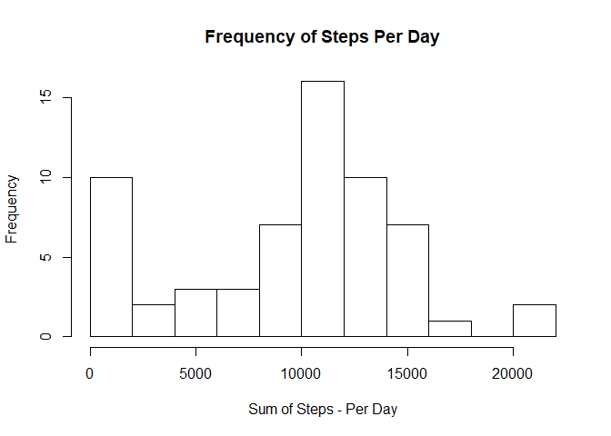
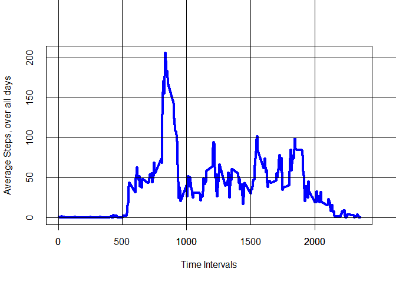
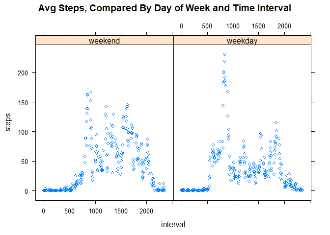

# Reproducible Research: Peer Assessment 1


## Loading and preprocessing the data

```r
library(ggplot2)
library(dplyr)
```

```
## 
## Attaching package: 'dplyr'
```

```
## The following objects are masked from 'package:stats':
## 
##     filter, lag
```

```
## The following objects are masked from 'package:base':
## 
##     intersect, setdiff, setequal, union
```

```r
library(data.table)
```

```
## 
## Attaching package: 'data.table'
```

```
## The following objects are masked from 'package:dplyr':
## 
##     between, first, last
```

```r
library(lattice)

temp <- tempfile()
download.file("https://d396qusza40orc.cloudfront.net/repdata%2Fdata%2Factivity.zip", temp)
data <- read.csv(unz(temp, "activity.csv"), stringsAsFactors = FALSE)
unlink(temp)

data$date <- as.Date(data$date, format="%Y-%m-%d")
```
## What is mean total number of steps taken per day?

###First Sum up the steps per  by date


```r
totalsteps <- tapply(data$steps, data$date, FUN=sum, na.rm=TRUE)
```

### Calculate the mean of steps, by date

```r
hist(totalsteps,  
     xlab ="Sum of Steps - Per Day",
     ylab = "Frequency",
     main = "Frequency of Steps Per Day",
     breaks=10)
```

<!-- -->

```r
mean(totalsteps)
```

```
## [1] 9354.23
```

### Calculate the median of steps, by date

```r
median(totalsteps)
```

```
## [1] 10395
```


## What is the average daily activity pattern?

```r
### Calculate Average Steps over Each Time Interval
intervalData <- tapply(data$steps, data$interval, mean,na.rm=TRUE) #creates array of intervals and their means
intDat <- as.data.frame(intervalData)
namesDat <- names(intervalData) #takes names of array, sets to variable #must be a faster way to do this
intervalCom <- cbind(namesDat, intDat)
colnames(intervalCom) <- c("Time_Interval", "Avg_Steps_alldays")
with(intervalCom, plot(namesDat, intervalData, 
                       xlab="Time Intervals", 
                       ylab="Average Steps, over all days", 
                       type="l", 
                       tck=1000,
                       lwd=4, 
                       col="blue"))
axis(1, at = seq(0, 2400, by = 1000))
```

<!-- -->

There seems to be a spike in steps in the same time interval

### Which time interval gives the max amount of steps?

```r
maxsteps <- max(intervalCom$Avg_Steps_alldays)
intervalCom[intervalCom$Avg_Steps_alldays == maxsteps, ]
```

```
##     Time_Interval Avg_Steps_alldays
## 835           835          206.1698
```

## Imputing missing values
### The number of missing values in the data is below

```r
sum(is.na(data))
```

```
## [1] 2304
```
### Remove NA values and replace with the mean of steps by interval

```r
data2 <- data %>% group_by(interval) %>% mutate( steps= ifelse(is.na(steps), mean(steps, na.rm=TRUE), steps))
```

### Recalcuate #Steps per day with no NA data


```r
totalstepsNoNA <- tapply(data2$steps, data2$date, FUN=sum, na.rm=TRUE)
```


### Recalculate Mean and Median & plot Mean

```r
hist(totalsteps, 
     xlab ="Sum of Steps - Per Day",
     ylab = "Frequency",
     main = "Frequency of Steps Per Day",
     breaks=10)
```

<!-- -->

```r
mean(totalsteps)
```

```
## [1] 9354.23
```

```r
median(totalsteps)
```

```
## [1] 10395
```


## Are there differences in activity patterns between weekdays and weekends?
###Attach Weekday or Weekend to data

```r
weekdays1 <- c('Monday', 'Tuesday', 'Wednesday', 'Thursday', 'Friday')
data2$wDay <- factor((weekdays(data2$date) %in% weekdays1), levels=c(FALSE, TRUE), labels=c('weekend', 'weekday'))
```


```r
groupwkd <- data2 %>%  group_by (wDay, interval) %>%  summarize(steps = mean(steps), )
head(groupwkd)
```

```
## # A tibble: 6 x 3
## # Groups:   wDay [1]
##      wDay interval       steps
##    <fctr>    <int>       <dbl>
## 1 weekend        0 0.214622642
## 2 weekend        5 0.042452830
## 3 weekend       10 0.016509434
## 4 weekend       15 0.018867925
## 5 weekend       20 0.009433962
## 6 weekend       25 3.511792453
```


```r
attach(groupwkd)
xyplot(steps~interval|wDay,
  main="Avg Steps, Compared By Day of Week and Time Interval")
```

<!-- -->
### It seems there are more steps during certain time intervals on the weekends compared to the weekdays.

